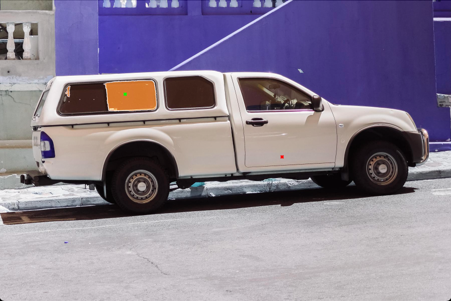

# autolabel

<!-- [](https://cyber-record.readthedocs.io/en/latest/?badge=latest)

**[autolabel](https://cyber-record.readthedocs.io/en/latest/)** is a cyber record file offline parse tool. You can use `autolabel` to read messages from record file, or write messages to the record file. -->

| os      | support                 | remark |
|---------|-------------------------|--------|
| ubuntu  | :heavy_check_mark:      |        |
| mac     | :heavy_check_mark:      |        |
| windows | :heavy_check_mark:      |        |


## Quick start
Install "autolabel" by the following command.
```shell
# install sam2
pip3 install 'git+https://github.com/facebookresearch/segment-anything-2.git'

# install autolabel
git clone https://github.com/wheelos/autolabel.git

cd autolabel & pip3 install -e .
```

download pretrained model
```shell
wget -P autolabel/checkpoints/ https://dl.fbaipublicfiles.com/segment_anything_2/072824/sam2_hiera_large.pt
```

## Command
You can easily automatically label images using the following command.

```shell
autolabel -c=autolabel/conf.yaml
```

After the execution is completed, the marked results will be displayed. **Press any key to exit!**



## Parameters

## Questiones

1. ImportError: libGL.so.1: cannot open shared object file: No such file or directory

```shell
pip3 install opencv-python-headless
```
